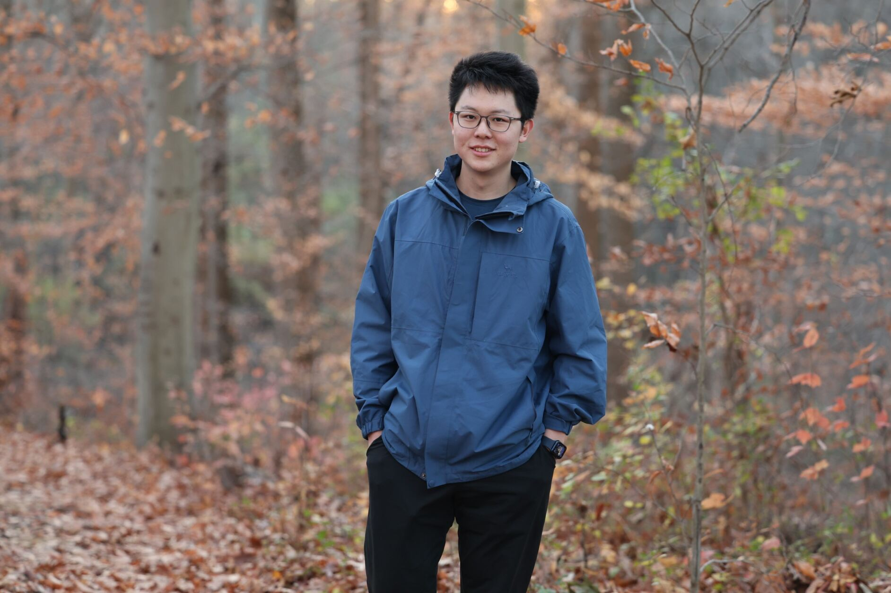

  

    

    I am a Ph.D. student at Electrical System and Engineering department of <a href="https://www.seas.upenn.edu/">University of Pennsylvania</a> working with professor <a href="https://www.cis.upenn.edu/~mingminz/">Mingmin Zhao</a>. I graduated from <a href="https://www.seu.edu.cn/">Southeast University</a> with a bachelor degree in Electrical Engineering with honor. 
    My research interests lie in the intersection between <b>wireless sensing</b> and <b>machine learning</b>. Currently I am working on <b>acoustic</b> and <b>sound</b> related topics! Feel free to drop me an email if you are interested in my research!
    

    

      <a href="mailto:ztlan@seas.upenn.edu">Email</a>
      <a href="https://scholar.google.com/citations?hl=en&user=5MzZf-oAAAAJ">Google Scholar</a>
      <a href="http://zitonglan.github.io/files/cv.pdf">CV</a>
    

  

 

    
  

 

Publication
=====
---

  

    
  

  

    

      <strong><a href="http://zitonglan.github.io">PIOWave: Physics-Guided Neural Impulse RespOnse Field via Implicit Wave Propagation Modeling</a></strong> 
      <strong>Zitong Lan</strong>, Chenhao Zheng, Zhiwei Zheng, Mingmin Zhao 
      Under review  
    

  

 

  

    
  

  

    

      <strong><a href="http://zitonglan.github.io/files/quantum.pdf">Quantum Wireless Sensing: Principle, Design and Implementation</a></strong> 
      Fusang Zhang, Beihong Jin, <strong>Zitong Lan</strong>, Zhaoxin Chang, Daqing Zhang, Yuechun Jiao, Meng Shi, Jie Xiong 
      <b><i>Mobicom</i>'23</b>  
      [<strong><a href="http://zitonglan.github.io/files/quantum.pdf">Paper</a></strong>]
    

  

 

  

    
  

  

    

        <strong><a href="http://zitonglan.github.io/files/BLEselect.pdf">BLEselect: Gestural IoT Device Selection via Bluetooth Angle of Arrival Estimation from Smart Glasses</a></strong> 
      Tengxiang Zhang, <strong>Zitong Lan</strong>, Chenren Xu, Yanrong Li, Yiqiang Chen 
      <b><i>IMWUT</i>'22</b>  
      [<strong><a href="http://zitonglan.github.io/files/BLEselect.pdf">Paper</a></strong>] [<strong><a href='https://www.youtube.com/watch?v=HvsFAsaLGPs'>Video</a></strong>] 
    

  

 

  

    
  

  

    

      <strong><a href="http://zitonglan.github.io/files/pccr.pdf">PCCR Based Wheelchair Control System</a></strong> 
      Zhenhao Ji, Yu Tian, Jifu Wang, Mingyuan Ding, Haoxin Wang, Yifan Chen, Jiahao Wen, <strong>Zitong Lan</strong>, Huiting Xu et.al.  
      <b><i>IEEE Circuits and Systems Magazine</i>, 2021.8</b>  
      [<strong><a href="http://zitonglan.github.io/files/pccr.pdf">Paper</a></strong>]
    

  

 

Experience
======
---
* <b>Aug. 2022 - May. 2023</b>: Research Assistant, [Institute of Software, Chinese Academy of Sciences](http://english.is.cas.cn/)
* <b>Oct. 2022 - Jan. 2023</b>: Research Intern, [University of Los Angeles](https://www.ee.ucla.edu/)
* <b>May. 2021 - Aug. 2022</b>: Research Intern, [Institute of Computing Technology, Chinese Academy of Sciences](http://english.ict.cas.cn/)
 

Awards
=====
---
* 2023 Howard Broadwell Fellow from Upenn.
* 2023 Outstanding Graduates in Southeast University. (5%)
* 2021 University Scholarship in Southeast University. (2%)
* 2020 IEEE CASS Student Design World Winner. (1st)