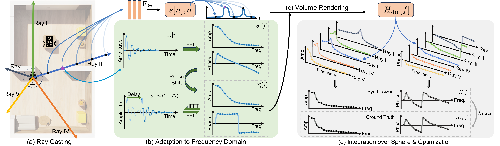
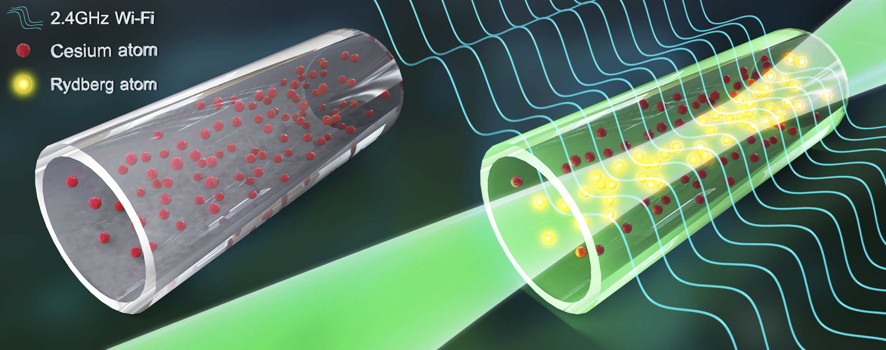
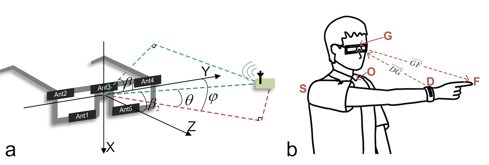
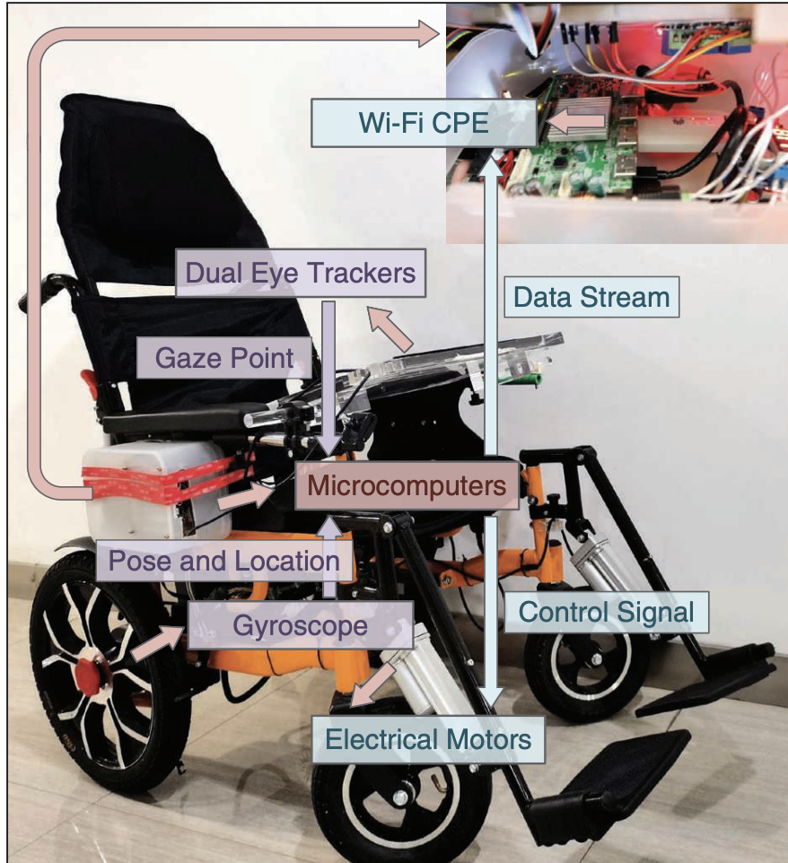

I am a Ph.D. student at Electrical System and Engineering department of [University of Pennsylvania](https://www.seas.upenn.edu/) working with professor [Mingmin Zhao](https://www.cis.upenn.edu/~mingminz/). I graduated from [Southeast University](https://www.seu.edu.cn/) with a bachelor degree in Electrical Engineering with honor. See my [full CV](http://zitonglan.github.io/files/cv.pdf).
 

Research interest
=====
---
My research interests lie in the intersection between wireless sensing and machine learning. Currently I am working on acoustic and sound related topics!
 

Publication
=====
---

  

    
  

  

    

      <strong><a href="http://zitonglan.github.io">PIOWave: Physics-Guided Neural Impulse RespOnse Field via Implicit Wave Propagation Modeling</a></strong> 
      <strong>Zitong Lan</strong>, Chenhao Zheng, Zhiwei Zheng, Mingmin Zhao 
      Under review  
    

  

 

  

    
  

  

    

      <strong><a href="http://zitonglan.github.io/files/quantum.pdf">Quantum Wireless Sensing: Principle, Design and Implementation</a></strong> 
      Fusang Zhang, Beihong Jin, <strong>Zitong Lan</strong>, Zhaoxin Chang, Daqing Zhang, Yuechun Jiao, Meng Shi, Jie Xiong 
      Mobicom'23  
      [<strong><a href="http://zitonglan.github.io/files/quantum.pdf">Paper</a></strong>]
    

  

 

  

    
  

  

    

        <strong><a href="http://zitonglan.github.io/files/BLEselect.pdf">BLEselect: Gestural IoT Device Selection via Bluetooth Angle of Arrival Estimation from Smart Glasses</a></strong> 
      Tengxiang Zhang, <strong>Zitong Lan</strong>, Chenren Xu, Yanrong Li, Yiqiang Chen 
      IMWUT'22   
      [<strong><a href="http://zitonglan.github.io/files/BLEselect.pdf">Paper</a></strong>] [<strong><a href='https://www.youtube.com/watch?v=HvsFAsaLGPs'>Video</a></strong>] 
    

  

 

  

    
  

  

    

      <strong><a href="http://zitonglan.github.io/files/pccr.pdf">PCCR Based Wheelchair Control System</a></strong> 
      Zhenhao Ji, Yu Tian, Jifu Wang, Mingyuan Ding, Haoxin Wang, Yifan Chen, Jiahao Wen, <strong>Zitong Lan</strong>, Huiting Xu et.al.  
      IEEE Circuits and Systems Magazine, 2021.8  
      [<strong><a href="http://zitonglan.github.io/files/pccr.pdf">Paper</a></strong>]
    

  

 

Awards
=====
---
* 2023 Howard Broadwell Fellow from Upenn.
* 2023 Outstanding Graduates in Southeast University. (5%)
* 2021 University Scholarship in Southeast University. (2%)
* 2020 IEEE CASS Student Design World Winner. (1st)