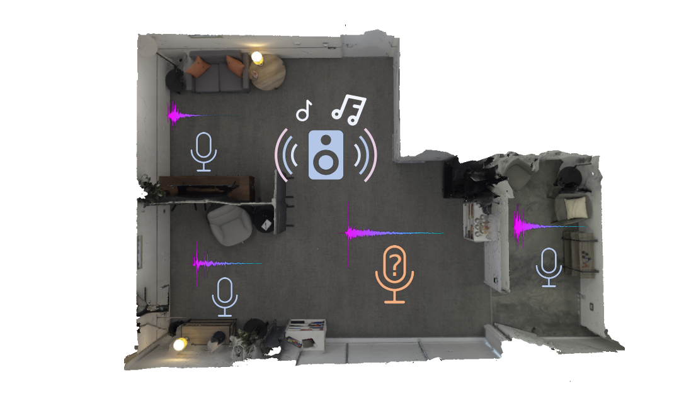

  

    

    I am currently a third year Ph.D. student at <a href="https://www.seas.upenn.edu/">University of Pennsylvania</a> where I work with Mingmin Zhao. Currently I am working on <b>audio</b> related topics, especially about audio generations/editing, audio language model and acoustic field modeling. Feel free to drop me an email if you are interested in my research for collaborations!
    I graduated from <a href="https://www.seu.edu.cn/">Southeast University</a> with a bachelor degree in Electrical Engineering with honor. In the past, I am very fortunate to work with Prof. Tengxiang Zhang, Fusang Zhang, Jie Xiong and Yang Zhang.
    

    

      <a href="mailto:ztlan@seas.upenn.edu">Email</a>
      <a href="https://scholar.google.com/citations?hl=en&user=5MzZf-oAAAAJ">Google Scholar</a>
      <a href="http://zitonglan.github.io/files/CV_zitonglan.pdf">CV</a>
    

  

 

    
  

 

<!-- I am actively looking for a 2026 summer internship position. I am interested in multimodal understanding and generation! Please reach out to me if there is a good fit. -->

News
=====
* (1/2026) Here we go! <strong><a href="https://arxiv.org/abs/2509.21625">SmartDJ</a></strong> is accepted by ICLR'26!!! See you in Brazil!
* (11/2025) <strong><a href="https://arxiv.org/abs/2509.21625">SmartDJ</a></strong> is accepted by NeurIPS'25 GenProCC workshop with Oral presentation, see you in San Diego! 
* (09/2025) Two papers are accepted at NeurIPS'25 main conference. (i) <strong><a href="https://arxiv.org/abs/2509.21625">Versa</a></strong> introduces a learning strategy inspired by the reciprocity principle for acoustic field training. (ii) <strong><a href="https://openreview.net/forum?id=f4Wd385vHi">HoloRadar</a></strong> leverages wall reflections to image the hidden people and object around the corner. 
* (09/2024) Our work on using Acoustic Volume Rendering (<strong><a href="https://arxiv.org/abs/2411.06307">AVR</a></strong>) for neural impulse response field is accepted to ***NeurIPS'24*** with ***Spotlight***! 
* (09/2023) I start my phd at Upenn.  

Selected Publications
=====
---

  

    
  

  

    

      <strong>Declarative Audio Editing with Audio Language Model</strong> 
      <strong>Zitong Lan</strong>, Yiduo Hao , Mingmin Zhao 
      <b><i>ICLR</i>'26</b>, <b><i>NeurIPS</i>'25 GenProcc </b> <b>Oral </b> 
      [<strong><a href="https://arxiv.org/abs/2509.21625">Paper</a></strong>][<strong><a href="../project/smartdj/smartdj.html">Project page</a></strong>]
          
       
    

  

 

  

    

      
    

    

      

        <strong>Building Audio-Visual Digital Twins with Smartphones</strong> 
        <strong>Zitong Lan et. al.</strong>,  
        <b>Submitted to Mobisys'26</b> 
        [<strong><a href="https://arxiv.org/pdf/2512.10778">Paper</a></strong>]
         
      

    

  

   

  

    
  

  

    

      <strong>Resounding Acoustic Fields with Reciprocity</strong> 
      <strong>Zitong Lan</strong>, Yiduo Hao, Mingmin Zhao  
      <b><i>NeurIPS</i>'25 </b>  
      [<strong><a href="https://arxiv.org/abs/2510.20602">Paper</a></strong>][<strong><a href="../project/versa/versa.html">Project page</a></strong>]
    

  

 

  

    
  

  

    

      <strong>Non-Line-of-Sight 3D Reconstruction with Radar</strong> 
      Haowen Lai, <strong>Zitong Lan</strong>, Mingmin Zhao  
      <b><i>NeurIPS</i>'25 </b>  
      [<strong><a href="https://openreview.net/forum?id=f4Wd385vHi">Paper</a></strong>][<strong><a href="https://waves.seas.upenn.edu/projects/holoradar/">Project page</a></strong>]
    

  

 

  

    
  

  

    

      <strong><a href="https://zitonglan.github.io/project/avr/avr.html">Acousitc Volume Rendering for Neural Impulse Response Field</a></strong> 
      <strong>Zitong Lan</strong>, Chenhao Zheng, Zhiwei Zheng, Mingmin Zhao 
      <b><i>NeurIPS</i>'24</b><b> Spotlight</b> 
      [<strong><a href="https://arxiv.org/abs/2411.06307">Paper</a></strong>][<strong><a href="../project/avr/avr.html">Project page</a></strong>][<strong><a href="https://github.com/penn-waves-lab/AVR">AVR code</a></strong>][<strong><a href="https://github.com/penn-waves-lab/AcoustiX">AcoustiX code</a></strong>]
    

  

 

  

    
  

  

    

      <strong><a href="http://zitonglan.github.io/files/quantum.pdf">Quantum Wireless Sensing: Principle, Design and Implementation</a></strong> 
      Fusang Zhang, Beihong Jin, <strong>Zitong Lan</strong>, Zhaoxin Chang, Daqing Zhang, Yuechun Jiao, Meng Shi, Jie Xiong 
      <b><i>Mobicom</i>'23</b>  
      [<strong><a href="http://zitonglan.github.io/files/quantum.pdf">Paper</a></strong>]
    

  

 

  

    
  

  

    

        <strong><a href="http://zitonglan.github.io/files/BLEselect.pdf">BLEselect: Gestural IoT Device Selection via Bluetooth Angle of Arrival Estimation from Smart Glasses</a></strong> 
      Tengxiang Zhang, <strong>Zitong Lan</strong>, Chenren Xu, Yanrong Li, Yiqiang Chen 
      <b><i>Ubicomp</i>'23</b>  
      [<strong><a href="http://zitonglan.github.io/files/BLEselect.pdf">Paper</a></strong>] [<strong><a href='https://www.youtube.com/watch?v=HvsFAsaLGPs'>Video</a></strong>] 
    

  

 

  

    
  

  

    

      <strong><a href="https://arxiv.org/abs/2407.19656">Exploring quantum sensing for fine-grained liquid recognition</a></strong> 
      Yuechun Jiao, Jinlian Hu, <strong>Zitong Lan</strong>, Fusang Zhang, Jie Xiong, Jingxu Bai, Zhaoxin Chang, Yuqi Su, Beihong Jin, Daqing Zhang, Jianming Zhao, Suotang Jia 
      <b><i>Arxiv preprint</i></b>  
      [<strong><a href="https://arxiv.org/abs/2407.19656">Paper</a></strong>]
    

  

 

<!-- 

  

    
  

  

    

      <strong><a href="http://zitonglan.github.io/files/pccr.pdf">PCCR Based Wheelchair Control System</a></strong> 
      Zhenhao Ji, Yu Tian, Jifu Wang, Mingyuan Ding, Haoxin Wang, Yifan Chen, Jiahao Wen, <strong>Zitong Lan</strong>, Huiting Xu et.al.  
      <b><i>IEEE Circuits and Systems Magazine</i>, 2021.8</b>  
      [<strong><a href="http://zitonglan.github.io/files/pccr.pdf">Paper</a></strong>]
    

  

  -->

Experience
======
---
* <b>Aug. 2023 - Now</b>: Research Assistant, [ESE of University of Pennsylvania](https://www.ese.upenn.edu/)
* <b>Aug. 2022 - May. 2023</b>: Research Assistant, [Institute of Software, Chinese Academy of Sciences](http://english.is.cas.cn/)
* <b>Oct. 2022 - Jan. 2023</b>: Research Intern, [University of Los Angeles](https://www.ee.ucla.edu/)
* <b>May. 2021 - Aug. 2022</b>: Research Intern, [Institute of Computing Technology, Chinese Academy of Sciences](http://english.ict.cas.cn/)
 

Awards
=====
---
* 2025 NeurIPS top reviewer, CVPR distinguished reviewer.
* 2024 NeurIPS travel grant.
* 2023 Howard Broadwell Fellow from Upenn.
* 2023 Outstanding Graduates in Southeast University. (5%)
* 2021 University Scholarship in Southeast University. (2%)
* 2020 IEEE CASS Student Design World Winner. (1st)

Beyond Research...
====
🏃‍♂️ Running | 🏊 Swimming | 🎾 Tennis | ⚽ Soccer | 🏸 Badminton  
🍣 Food | 🌱 Plants | 🎬 Movies | 🎹 Piano  
🇯🇵 Studying Japanese — こんにちは！